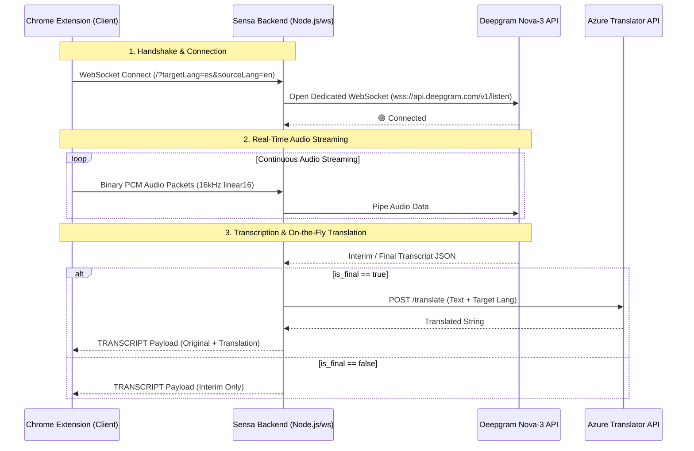

# 🚀 Sensa Backend — Real-Time WebSocket Streaming & Translation Bridge

[](https://nodejs.org/)
[](https://github.com/websockets/ws)
[](https://deepgram.com/)
[](https://azure.microsoft.com/en-us/products/cognitive-services/translator)

**Sensa Backend** is a high-performance Node.js server that acts as a real-time WebSocket streaming bridge and REST translation proxy for the **Sensa Chrome Extension**. It securely routes live audio from browser tabs to cloud AI models while keeping sensitive API credentials completely isolated from the client.

---

## 🏗️ Architectural Overview



### Key Responsibilities:
1. **API Key Isolation:** Protects `DEEPGRAM_API_KEY`, `AZURE_TRANSLATOR_KEY`, and `AZURE_REGION` by handling all authentication server-side.
2. **Low-Latency Audio Piping:** Forwards raw 16kHz linear16 PCM audio packets from Chrome's `tabCapture` directly to Deepgram's `nova-3` speech recognition engine.
3. **Smart Quota Protection:** Translates text via Azure Translator *only* when Deepgram marks an utterance as finalized (`is_final: true`), preventing redundant translation API calls on interim speech guesses.
4. **Cloud Keep-Alive Heartbeat:** Emits a ping/pong frame every 30 seconds to clean up dead sockets and prevent cloud load balancers (e.g., Render, Heroku, AWS ALB) from terminating idle connections.

---

## 🔌 API & Endpoints Reference

### 1️⃣ WebSocket Bridge Endpoint
* **URL:** `ws://localhost:3000/?targetLang={LANG}&sourceLang={LANG}` (or cloud wss URL)
* **Query Parameters:**
  * `targetLang` (optional, default `es`): The target language ISO code for Azure Translator (e.g., `es`, `fr`, `de`, `ja`, `ko`, `fil`).
  * `sourceLang` (optional, default `en`): The spoken source language code for Deepgram speech recognition (supports 45+ languages including `en`, `es`, `fil`, `he`, `ar`).
* **Incoming Client Messages:** Raw binary audio buffers (`ArrayBuffer` / `Buffer`).
* **Outgoing Client Messages:** JSON strings formatted as:
  ```json
  {
    "type": "TRANSCRIPT",
    "text": "Hello, welcome to our presentation.",
    "translated": "Hola, bienvenidos a nuestra presentación.",
    "isFinal": true
  }
  ```

---

### 2️⃣ REST Endpoints

#### `GET /` or `GET /health`
* **Purpose:** Health check and cloud host wake-up ping.
* **Response:** `200 OK`
  ```json
  { "status": "ok" }
  ```

#### `POST /translate`
* **Purpose:** Standalone REST translation proxy for text blocks (used by extension utilities).
* **Request Body:**
  ```json
  {
    "text": "Good morning, how can I help you today?",
    "targetLang": "FR"
  }
  ```
* **Response:** `200 OK`
  ```json
  {
    "ok": true,
    "translated": "Bonjour, comment puis-je vous aider aujourd'hui ?"
  }
  ```

---

## ⚙️ Setup & Installation

### 1. Prerequisites
* **Node.js**: v18.0.0 or higher
* **API Keys**:
  * [Deepgram API Key](https://console.deepgram.com/) (with access to `nova-3`)
  * [Azure Translator Key](https://portal.azure.com/)

### 2. Environment Configuration
Create a `.env` file in the root of `sensa-backend/`:

```env
PORT=3000
DEEPGRAM_API_KEY=your_deepgram_api_key_here
AZURE_TRANSLATOR_KEY=your_azure_translator_key_here
AZURE_REGION=eastasia
```

### 3. Install Dependencies & Run
```bash
# Install packages
npm install

# Start the server
npm start
```

You should see the startup confirmation in your terminal:
```text
🚀 Starting Sensa Backend...
✅ Server is listening on port 3000
```

---

## ☁️ Cloud Deployment Guidelines

When deploying to cloud platforms (such as **Render**, **Railway**, **Fly.io**, or **Heroku**):
1. **WebSockets Support:** Ensure your host natively supports WebSocket upgrades over HTTPS (`wss://`).
2. **Environment Variables:** Add `DEEPGRAM_API_KEY`, `AZURE_TRANSLATOR_KEY`, and `AZURE_REGION` in your cloud provider's dashboard.
3. **Cold Starts:** If deploying on a free tier that sleeps after inactivity, the extension automatically calls `GET /health` on startup to wake up the server before initializing live speech streaming.

---

## 📄 License & Acknowledgments
* Built by **BSIT 4H-G1 Group 2 — Bulacan State University (BulSU)**.
* Powered by [Deepgram Nova-3](https://deepgram.com/) and [Azure Translator API](https://azure.microsoft.com/).
